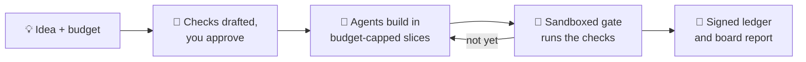

<div align="center">




**The full technical tour: [README-technical.md](README-technical.md)**

</div>

## 🚦 The one-minute pitch

You give AntStreet an idea and a budget.

1. 📝 It drafts pytest checks. **You approve them before any code exists.**
2. 🤖 Headless Claude Code agents build in small, budget-capped slices.
3. 🧱 A sandboxed gate, not the agent, decides what passed.
4. 🧾 Every dollar and every decision lands on a signed, hash-chained ledger.

The AI drafts. You and plain code decide.

`antstreet` and `boss` are the same command: `boss` is the bull you talk to.

<p align="center">



</p>

The pig is you, the investor. The bull is the boss, the model that drafts the checks. The ants are
the worker agents. Placeholder art, until an illustrator draws the real thing.

## 🎬 See it run



That is a replay of a test-suite run with a fake model, so the check is a toy one. The output
strings are the real ones. Try it yourself in [the quickstart](#-quickstart).

## 🧨 The problem

Agents say "done" and mean "I stopped". We measured how often that is wrong.

> **29 of 77 runs (38%, 95% interval 28-49%)** passed every check the model had written and still
> failed a hand-written check it never saw. Every one of the 29 was a real error against the task text.

Caveats, kept on purpose: 17 small Python tasks, Haiku writing both the checks and the code, and
runs of one task are not independent (resampling tasks widens the interval to 20-57%). 13 of the 29
failed only on non-ASCII input or a returned type; without those, 16 of 77 (21%). Read the
[false-pass audit](bench/results/2026-10-03-false-pass-audit/README.md).

## 🧪 We measure, and we publish the "no"

A fair, blinded benchmark: 35 tasks, three runs each, $0.40 a task, hidden checks written by hand
and never shown to any agent.

| | passed | cost per task |
|---|---|---|
| firm (`boss`) | 64 of 105 (61%) | $0.2149 |
| one agent | 62 of 105 (59%) | $0.0883 |

**Paired by task, the difference is not shown, and the firm cost about 2.4 times as much.** So we
do not claim a team of agents builds better than one agent on small tasks. We measured it, it did
not, and the earlier, rosier headline did not survive a fair re-run. The value of AntStreet is
**verification and control**, not "more agents".
Details: [blind35 notes](bench/results/2026-10-03-blind35/README.md), [bench/METHOD.md](bench/METHOD.md).

## 🔭 How it flows



## ✨ Why it is different

| | |
|---|---|
| ✅ **Checks before code** | You read and approve the checks first. Workers cannot edit them. |
| ⚖️ **The gate decides** | A pass needs pytest to exit 0 and a signed proof that every test really ran. |
| 💸 **Budget caps and firing** | Money is released in rounds against passing checks. Stalled workers are fired. |
| 🔏 **A ledger you can trust** | Hash-chained lines, each one signed with a key no worker can read. |

## 🛠️ How it's engineered

Built like something you would be happy to inherit.

- **5,000+ tests**, no model calls needed (recorded CLI output and fake `claude` executables).
- **Coverage floor 96%** (line and branch) enforced in CI; about 98% measured when the floor was set.
- **`mypy --strict`** over `src/`, plus ruff.
- **A threat model with 69 rows**, each bound to a test that proves its control
  ([THREAT_MODEL.md](docs/THREAT_MODEL.md)).
- **A signed, hash-chained ledger**: edit a line and the chain breaks.
- **A sandboxed gate**: macOS seatbelt; Linux `bwrap` is set up for CI but not yet confirmed there.
- **A blinded, pre-registered benchmark**: six experiments fixed before any run
  ([bench/PREREG.md](bench/PREREG.md)).
- **45 recorded design decisions**, including what was rejected and why
  ([DECISIONS.md](docs/DECISIONS.md)).
- **Docs that cannot drift**: tests fail when this README, the CLI docs or the ledger docs disagree
  with the code.

## 🚀 Quickstart

You need macOS or Linux, Python 3.12+, [uv](https://docs.astral.sh/uv/) and
[Claude Code](https://code.claude.com), logged in (`claude auth login`).

```bash
git clone https://github.com/kgorle1111/antstreet.git
cd antstreet
uv sync
uv run boss doctor --live        # checks this machine; two paid calls of at most $0.05 each
uv run boss fund "A function is_palindrome(text) that ignores case, spaces and punctuation." --budget 0.40
```

After the PyPI release (not yet published), `uvx antstreet fund "..." --budget 0.40` will work
without a clone. `boss fund` shows the term sheet and waits for your yes. Then `uv run boss report` reprints the
board report, and `uv run boss resume` continues an interrupted run. Every command and option:
[docs/CLI.md](docs/CLI.md). It also audits someone else's agent: `boss audit` seals checks before the
agent starts and tests its commit afterwards.

## 🧭 Status and honest limits

Early and pre-release. It works end to end, and:

- It is **not yet better than one agent at building** (see the table above).
- A determined adversary can forge a pass ([T12](docs/THREAT_MODEL.md#t12), accepted). Do not run
  ideas or code from sources you do not trust.
- Checks catch only what they test, and the boss can write a weak one: you reading them is the control.
- Python with pytest only; one machine, one user.

Everything else, with the threat rows: [README-technical.md](README-technical.md) and
[THREAT_MODEL.md](docs/THREAT_MODEL.md).

## 🗺️ Roadmap (planned, not built)

- A Claude Code plugin
- A PyPI release, so `uvx antstreet` works (the name is chosen; nothing is published yet)
- A GitHub Action that runs `boss audit check` on a pull request

See [docs/BACKLOG.md](docs/BACKLOG.md).

## 🤝 Contributing

Bug reports, new benchmark tasks and sharper checks are welcome. Start with
[CONTRIBUTING.md](CONTRIBUTING.md). Security problems: [SECURITY.md](SECURITY.md). If this made you
think, a star helps others find it. ⭐

## 📄 License

Apache License 2.0. See [LICENSE](LICENSE).
