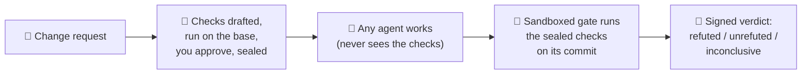

<div align="center">

# AntStreet: tests your coding agent never saw


**The full technical tour: [README-technical.md](README-technical.md)**

</div>

**AntStreet checks your AI coding agent's work against tests it never saw, so "all tests pass"
actually means something.**

Your agent writes the code *and* the tests, like a student who writes their own exam. AntStreet is
the answer key the student never sees.

## 🚦 In three steps

1. 🔏 **Seal.** Before the agent starts, `antstreet audit plan` drafts checks from your change
   request. You read and approve them, and they are sealed with a SHA-256, outside the repo.
2. 🤖 **Let any agent work.** Claude Code, Codex, Cursor, a person: the audit never talks to it,
   and the agent never sees the checks.
3. 🧱 **Check the "done".** `antstreet audit check --claim done` runs the sealed checks on the
   agent's commit in a sandbox and signs a verdict: `refuted`, `unrefuted`, `inconclusive` or
   `no_claim`.

The AI drafts. You and plain code decide.

## 🎬 See it run


```text
$ antstreet audit plan --request ~/req.txt
Running the checks on the base...
Check c01 [t1] runs of symbols become one hyphen
Check c02 [t1] hyphens are trimmed at both ends
Check c03 [t1] a plain word is unchanged
Check c04 [t1] needs a library
  c01: fails on the base: counted
  c02: fails on the base: counted
  c03: passes on the base: shown, not counted
  c04: cannot run here: not counted (needs module 'nosuchlib_zq')
[a]pprove, [r]eject, or [e]dit files and re-check? a
Sealed audit run <run>: 2 of 4 checks fail on the base and will be counted.
Seal: <sha256>

# the agent works on its branch, commits, and says it is done

$ antstreet audit check --claim done
Verdict: REFUTED (claim: done, pre-registered)
Counted checks (failing on the base): 2; failing on the head: 2
  c01 failed: runs of symbols become one hyphen
  c02 failed: hyphens are trimmed at both ends
```

The agent said "done". Two checks it never saw say otherwise. This is the output of a test-suite
run with a fake model, abridged (each check's code is left out), so the request is a toy one: make
`slugify` collapse runs of symbols into one hyphen. Every output line is one the real command
prints; a test re-runs it to keep it that way. Try it on your own repo in
[the quickstart](#-quickstart).

## 🧨 The problem

Agents say "done" and mean "I stopped". We measured a narrower thing: how often a run can satisfy the checks the model drafted and still be wrong.

> **29 of 77 runs (38%, 95% interval 28-49%)** passed every check the model had written and still
> failed a hidden check it never saw (written by Claude, separately from the agents measured).
> We read all 29 against the task text and judge each a real error; one class (tokenbucket's int-vs-float
> return) is debatable.

Caveats, kept on purpose: 17 small Python tasks, Haiku writing both the checks and the code, and
runs of one task are not independent (resampling tasks widens the interval to 20-57%). 13 of the 29
failed only on non-ASCII input or a returned type; without those, 16 of 77 (21%). These were
AntStreet's own build runs, not a general agent failure rate. Read the
[false-pass audit](bench/results/2026-10-03-false-pass-audit/README.md).

The lesson: tests written by the same mind that wrote the code share its blind spots. Checks sealed
before the work starts, and never shown to the agent, do not.

## 🔭 How it flows



## ✨ Why it is different

| | |
|---|---|
| 🙈 **The agent never sees the checks** | They are drafted from your request and the base's public names only, and kept in a store outside the repo. |
| 🎯 **Only checks that bite are counted** | Each check runs on the base first. Only the ones that fail there, and so can tell a finished change from an unfinished one, decide the verdict. |
| 🧱 **A gate, not a model, decides** | pytest in an OS sandbox, with a signed proof that every test really ran. The agent's own words never reach the verdict. |
| 🔎 **It notices cheating** | A change that quotes the sealed checks is flagged, and base tests the agent deleted or broke are listed beside the verdict. |
| 🔏 **A record you can check** | Every approval and verdict is on a signed, hash-chained ledger, and an automatic decision is never signed in your name. |

## 🚀 Quickstart

You need macOS or Linux, Python 3.12+, [uv](https://docs.astral.sh/uv/) and
[Claude Code](https://code.claude.com), logged in (`claude auth login`). AntStreet is coming to
PyPI; until then, run it from a clone:

```bash
git clone https://github.com/kgorle1111/antstreet.git ~/antstreet
cd ~/antstreet && uv sync
```

Then, in the Python repo your agent will change (a clean working tree):

```bash
alias antstreet="uv run --project ~/antstreet antstreet"
antstreet audit plan --request ~/req.txt   # the change request, in plain words, kept outside the repo
# ... the agent works and commits ...
antstreet audit check --claim done         # the latest sealed run, against HEAD
antstreet audit report                     # every verdict, and the false-pass rate
```

Or run `antstreet audit` on its own: it does whichever step comes next for the repo, seal or check.
Beside the verdict it also runs a check-strength pass, which flags counted checks that survive
deliberately broken copies of your changed lines as weak. That is advice only and never changes the
verdict; `--no-strength` skips it.

`audit plan` makes one model call (Haiku by default) to draft the checks. The checks run with your
repo's own `.venv` packages, read-only inside the sandbox; nothing is installed. Every option:
[docs/CLI.md](docs/CLI.md).

## 🧪 We measure, and we publish the "no"

Every experiment's rule is fixed in [bench/PREREG.md](bench/PREREG.md) before it runs. Four have
run. **None has shown its benefit, and every one is published.**

The headline loss: a fair, blinded benchmark of AntStreet's build mode. 35 tasks, three runs each,
$0.40 a task, hidden checks written separately from the agents being measured (by Claude, in a
different session), validated against a reference solution and planted wrong solutions, and never
shown to any agent.

| | passed | cost per task |
|---|---|---|
| AntStreet (boss + ants) | 64 of 105 (61%) | $0.2149 |
| one agent | 62 of 105 (59%) | $0.0883 |

**Paired by task, the difference is not shown, and the firm cost about 2.4 times as much.** So we
do not claim a team of agents builds better than one agent. The earlier, rosier headline did not
survive a fair re-run. The value is **verification and control**, which is why the audit leads.
Details: [blind35 notes](bench/results/2026-10-03-blind35/README.md), [bench/METHOD.md](bench/METHOD.md).

The closest call so far, E4b: the build mode with a fresh-context critic delivered 74 of 105 (70%) against 61% for
self-review, with the fewest false passes (24%), at about 1.56x the cost per delivered task. The
pre-registered interval is +0.0952 [-0.0000, +0.1905]: its lower bound is not above zero, so the
verdict is **not shown**, and we do not round it up.
[E4b write-up](bench/results/2026-10-07-e4b-critic/README.md).

## 🛠️ How it's engineered

Built like something you would be happy to inherit.

- **5,700+ tests**, no model calls needed (recorded CLI output and fake `claude` executables).
- **Coverage floor 96%** (line and branch) enforced in CI; about 98% measured when the floor was set.
- **`mypy --strict`** over `src/`, plus ruff.
- **A threat model with 71 rows**, each bound to the test for its control
  ([THREAT_MODEL.md](docs/THREAT_MODEL.md)).
- **A signed, hash-chained ledger**: edit a line and the chain breaks.
- **A sandboxed gate**: macOS seatbelt; Linux `bwrap`, run and required in CI.
- **7 pre-registered experiments**, with every change to the plan dated
  ([bench/PREREG.md](bench/PREREG.md)).
- **46 recorded design decisions**, including what was rejected and why
  ([DECISIONS.md](docs/DECISIONS.md)).
- **Docs that cannot drift**: tests fail when this README, the CLI docs or the ledger docs disagree
  with the code, and the audit output above is re-run and compared with what the command prints.

## 👋 Built by

[Kannishk Naidu Gorle](https://github.com/kgorle1111), an AI engineer working on evals, agent
reliability and systems that hold up under a deep review. AntStreet was built with AI coding
agents and held to the same discipline it sells: every change through a pull request, every claim
bound to a test, every negative result published.

## 🧰 Advanced and experimental: `antstreet fund`

AntStreet started as a firm of agents: you give it an idea and a budget, the boss drafts checks you
approve, and budget-capped worker agents build until the gate says pass, with every dollar on the
ledger.

It works end to end, and it is **not shown to build better than a single agent**, at about 2.4
times the cost (the table above). Try it if you are curious; do not pick it for results.

```bash
cd ~/antstreet
uv run antstreet doctor --live      # checks this machine; two paid calls of at most $0.05 each
uv run antstreet fund "A function is_palindrome(text) that ignores case, spaces and punctuation." --budget 0.40
```

The pig is you, the investor. The bull is the boss, the model that drafts the checks. The ants are
the worker agents. Optional roles (the critic is the one we suggest) and model dispatch are
off unless you ask for them. Every command: [docs/CLI.md](docs/CLI.md).

<p align="center">


</p>

## 🧭 Status and honest limits

Early and pre-release. It works end to end, and:

- **`unrefuted` is not proof.** The sealed checks catch only what they test, and a model drafts
  them: you reading them before you approve is the control.
- A determined adversary can forge a pass ([T12](docs/THREAT_MODEL.md#t12), accepted). Do not run
  ideas or code from sources you do not trust.
- An agent running as your own OS user could read the audit store; keeping it out needs another
  user or a container (T51 in the [threat model](docs/THREAT_MODEL.md)).
- Python with pytest only; one machine, one user. Not on PyPI yet.

Everything else, with the threat rows: [README-technical.md](README-technical.md) and
[THREAT_MODEL.md](docs/THREAT_MODEL.md).

## 🗺️ Where it's going (planned, not built)

Recently shipped: **one command**, `antstreet audit`, which does the next step (seal or check) and
powers a Claude Code Stop hook that reports the verdict to you when the agent stops
(([#69](https://github.com/kgorle1111/antstreet/pull/69))); **check strength**, which runs the counted checks against deliberately broken copies of
the changed lines and flags a check that passes them all as weak, as advice that never changes the
verdict (([#71](https://github.com/kgorle1111/antstreet/pull/71))); and opt-in **approval as a few yes/no questions**
(`audit plan --questions`, offline eval only so far; the live eval is pending)
(([#72](https://github.com/kgorle1111/antstreet/pull/72))). The agent also cannot run `antstreet audit` or read the audit store from inside Claude
Code, a guard and tripwire rather than a sandbox (([#75](https://github.com/kgorle1111/antstreet/pull/75))).

Next: **`antstreet` on PyPI** (imminent, not published yet), which the Stop hook and a zero-install
`uvx` audit wait on, and **CI export** for the GitHub Action, then a first-run guide. Planned after
that: the **Agent Honesty Report**, a pre-registered public measurement of how often coding agents
pass their own tests while hidden checks fail.

The full plan, every experiment and what we will not do: [ROADMAP.md](ROADMAP.md).

## 🤝 Contributing

Bug reports, new benchmark tasks and sharper checks are welcome. Start with
[CONTRIBUTING.md](CONTRIBUTING.md). Security problems: [SECURITY.md](SECURITY.md). If this made you
think, a star helps others find it. ⭐

## 📄 License

Apache License 2.0. See [LICENSE](LICENSE).
